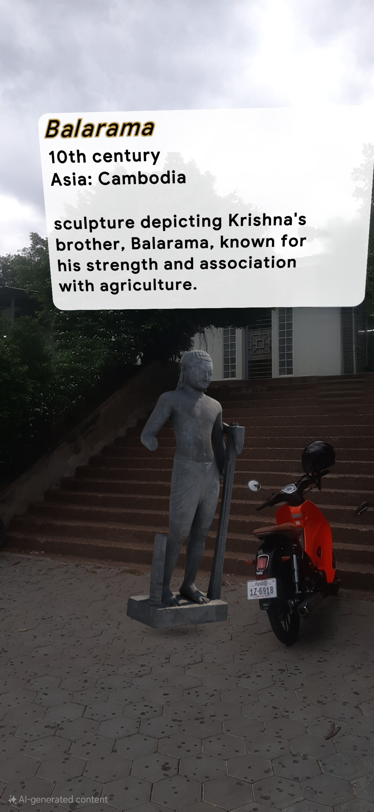

# AR-ITE-RUPP

 

------------
 

## Requirements

Your app will require the following:
- Internet and GPS access.
- The experience works best outdoors.
- A compatible device: Android: Google Pixel 2 or later device for optimum performance.

 

------------
 

## Developer Setup

The app has not been released to the public on a mobile app store, but the code can be downloaded and built in Unity. So far the experience has only been tested on fairly recent Android phones, such as a Pixel or Samsung Galaxy 7 or higher.

- [Unity App](#setup-unity)
- [ARCore Geospatial API Key](#setup-geo-ar)
- [Firestore Database (optional)](#setup-firestore)
- [Client Setup](#setup-app)

 

### Unity App

1. Download Unity version [2019.4.36f1](https://unity3d.com/unity/qa/lts-releases?version=2019.4) for compatibility. We recommend using Unity Hub.

2. Clone this repo to your machine (optionally fork this repository if you plan on expanding on it).

3. Open the project in Unity 2019.4.36f1, and open the 'BalloonPopAR' scene (if it doesn't open automatically).

4. Follow the steps below in the ['ARCore Geospatial API Key'](#setup-geo-ar) section

5. Follow the steps below in the ['TTS API Key'](#setup-tts-ar) section

6. Follow the steps below in the ['Firestore Database'](#setup-firestore) section

7. Follow the steps below in the ['Client Setup'](#setup-app) section

8. Deploy to an [ARCore compatible device](https://developers.google.com/ar/discover/supported-devices).

 

### Screenshots:

    
    
    
    

### ARCore Geospatial API Key

You will need an API Key with ARCore Geospatial API enabled for your app to use GeoAR features.

Follow the steps [here to in order to obtain an API key.](https://developers.google.com/ar/develop/geospatial/unity-arf/developer-guide)

Add the API Key to your Unity Project:
1. Open the Unity Project Settings

2. Under 'XR Plug-in Management', click on 'ARCore Extensions'

3. Past the Android API Key into the 'Android API Key' textfield

4. 'Geospatial' should be turned on

 

### TexTtoSpeech API Key

You will need an API Key with ARCore Geospatial API enabled for your app to use GeoAR features.

Follow the steps [here to in order to obtain an API key.](https://cloud.google.com/text-to-speech?hl=en)

Add the API Key to your Unity Prefab Scenes:
1. Open Unity Prefab Scenes

2. In 'TTS Manager', click on 'API keys'

3. Past the API Key into the 'Api Key' textfield

4. Audio Encoding 'Mp3' as defualt audio clip file

5. 'TexttoSpeech' should be heard from devices when close to prefabs with dynamic 'Speak' button

 

### TTS Setup:

### Firestore geoite Database

The project uses the Firestore database in Firebase to save geoite coordinates, send geoite pops and listen for changes in geoites near the user. This allows the game to keep a shared global state of geoite locations, creating a multiplayer experience of geoite placing and popping.

#### Install Firebase

Import the following plugins - using `Assets > Import Package > Custom Package` menu item - from the [Firebase Unity SDK](https://firebase.google.com/docs/unity/setup):

##### IMPORTANT
After importing the Firebase packages you may run into a compatibility issues with the ExternalDependencyManager (EDM) that ships with both Firebase and and ARCore Extensions. We recommend using whichever version is newer. 

If ARCore Extensions has a newer EDM you may uncheck the 'ExternalDependencyManager" when  importing these packages:

* FirebaseAuth.unitypackage
* FirebaseFirestore.unitypackage

If Firebase is using a newer EDM we suggest installing the lite version of ARCore Extensions per the instructions [here](https://developers.google.com/ar/develop/unity-arf/getting-started-extensions#without-edm4u). 

#### Create a Firebase API Key

1. Create a [Firebase account if you don't already have one](https://firebase.google.com/docs/firestore/quickstart#create)

2. Add a new project in the [Firebase Console](https://console.firebase.google.com/).

3. In the 'Build' -> 'Firestore Database' section of your project click ['Create a database'.](https://console.firebase.google.com/project/webgl-exploration/firestore)

4. Select production mode and choose a relevant region for your Cloud Firestore data to be stored.

5. Create a new collection in your database and name it 'geoites'.

6. Go to your 'Project settings' -> 'General' -> 'Your apps' and click the 'Add app' button. Click the button with the Unity icon on it.

7. Choose a unique package name (for Android), then download the 'google-services.json' config file for the Android build.

8. Now place the 'google-services.json' config file in the 'StreamingAssets' folder within the Unity project. (Assets -> StreamingAssets -> 'google-services.json').

 

### Client Setup

### 1. USER ACTIONS
Represents the Mobile User’s interactions through the AR app:[here](https://ruppedukh-my.sharepoint.com/:u:/g/personal/thoeun_pisethta_2821_rupp_edu_kh/EfzfUkmoJPxDolK4XCqnzg4BLf9Yb0i8zRtuZbKBrPoqsQ?e=DzCVT6)
* Start User Session: Launches the AR experience. (Android API 24)
* Permissions: allow Camera, Locations or GPS, Internets Access.

### 2. ADMIN ACTIONS
Describes how an admin adds content via the Web Admin Panel:[here](https://github.com/Vignou/web_AR_SE.git).
* Start Admin Session: Admin logs into the dashboard.
* Enter Object Name or Code
* Enter Descriptions
* Place Object on Map UI
* Enter Altitude (Optional)

### 3. SYSTEM PROCESSING
Handles backend processes:
* Store Data: Saves geo-based content into FirebaseFirestore
* Process TTS: Generates speech output when users walk near to the object.

### 4. SYSTEM COMPONENTS
* Mobile AR App and Web Admin Panel are linked to their respective users.
* All flow routes pass through the appropriate system channels and interact
with Firebase
 

------------

## Contributors

 - [Thoeun Pisethta](https://github.com/Pheng-AN)
 - [Mam Sovanratana](https://github.com/RatanaJr)
 - [Pok Tepvignou](https://github.com/Vignou)

 
